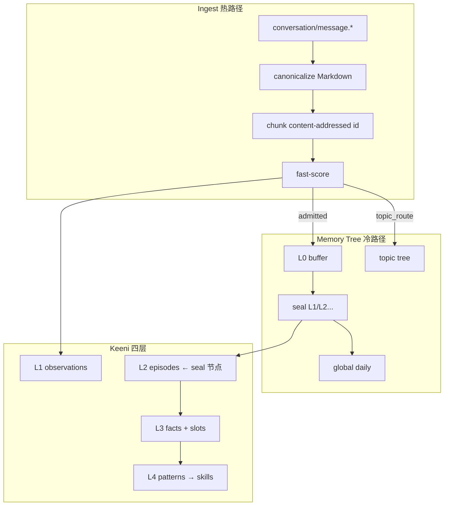

# KeenAI Memory Tree 技术方案

> **分层摘要树（Summary Tree）** — 在 [10-AGENT-MEMORY.md](10-AGENT-MEMORY.md) 四层模型与 AgentMemory/Mastra 之上，引入 [OpenHuman Memory Trees](https://tinyhumans.gitbook.io/openhuman/features/obsidian-wiki/memory-tree) 的 **确定性 ingest · bucket-seal · 三 scope 导航** 能力。  
> **不替代** Memory/KB 分工；**增强** L2 巩固、多 scope 检索与日摘要。

| 维度 | 选型 |
|------|------|
| **定位** | `@keenai/memory` 子模块（或 `@keenai/memory-tree`） |
| **参考** | OpenHuman Memory Tree · [agentmemory](https://github.com/rohitg00/agentmemory)（KeenAI 已对标） |
| **热路径** | canonicalize → chunk（content-addressed）→ fast-score → persist → enqueue |
| **冷路径** | Inngest workers：extract · append_buffer · seal · topic_route · digest_daily |
| **三棵树** | Source（对话/渠道）· Topic（客户/实体 + hotness）· Global（brand 日 digest） |
| **存储** | PG/LibSQL 表 + FTS/Vector（见 [07-DATA-MODEL.md § 4.9](07-DATA-MODEL.md)） |
| **输入** | 对话消息 · 邮件 thread · 工单评论 · [14-MULTIMODAL](14-MULTIMODAL.md) enriched text |
| **与 KB** | **分离** — KB 管集体产品知识；Memory Tree 管个体/时效事件流 |

---

## 一、为何需要 Memory Tree

向量检索擅长「和 query 相似的内容」，客服 Agent 还需要：

| 问题 | 纯向量 / 扁平 episode | Memory Tree |
|------|----------------------|-------------|
| 今天 support 发生了什么？ | 难聚合 | **Global daily digest** |
| 这个客户最近主线？ | facts 分散 | **Topic tree** + hotness |
| 这条邮件线程上次说到哪？ | 全 thread 太长 | **Source tree** L0/L1 seal |
| 这条摘要从哪来？ | evidence 弱 | chunk + lifecycle + message 跳转 |

OpenHuman 文档原话：树提供 **compression + navigation**；embedding 仍在 chunk 内，结构在上层。

KeenAI 保留 **L1–L4 四层语义**（Working/Episodic/Semantic/Procedural），Memory Tree 主要 **重写 L2 产出方式** 并 **扩展检索 scope**。

---

## 二、OpenHuman 结构摘要（对照用）

来源：[Memory Trees · OpenHuman Docs](https://tinyhumans.gitbook.io/openhuman/features/obsidian-wiki/memory-tree)

### 2.1 管线

```
source adapters → canonicalize → chunker → content_store (.md)
  → store (chunks.db) → score → source/topic/global trees → retrieval
```

### 2.2 三 scope

| 树 | Scope | KeenAI 映射（见 §四） |
|----|-------|----------------------|
| Source | 每 Gmail label / Slack channel / 文档 | 每 **conversation** 或 **channel** |
| Topic | 每实体，**hotness** 驱动 | 每 **customer** / KG entity |
| Global | 每 UTC 日一条 digest | 每 **org+brand** 日摘要 |

### 2.3 Job kinds

| Kind | 作用 |
|------|------|
| `extract_chunk` | 深打分 + 实体 → `admitted` / `dropped` |
| `append_buffer` | admitted leaf → L0 buffer |
| `seal` | L0 → L1 摘要，可向上 cascade |
| `topic_route` | hotness 够才进 topic tree |
| `digest_daily` | 全局日 digest |
| `flush_stale` | 超时 buffer 强制 seal |

### 2.4 Leaf 生命周期

```
pending_extraction → admitted → buffered → sealed
                  ↘ dropped（保留 provenance，不进摘要）
```

OpenHuman 可选 `MemoryConfig.backend = "agentmemory"` — KeenAI **不集成**外部 agentmemory daemon；Memory Tree 数据仅存 LibSQL（§九 为历史设计参考）。

---

## 三、与 KeenAI 四层 Memory 的关系



| 层级 | 原有机制 | + Memory Tree |
|------|----------|---------------|
| L1 Working | Mastra messages + observations | chunk 行 + `admitted`/`dropped` |
| L2 Episodic | 会话结束 LLM 单次摘要 | **source tree seal** 物化 episode |
| L3 Semantic | facts + workingMemory slots | 不变；可从 L1 seal 批量抽取 |
| L4 Procedural | pattern mining | 不变 |

---

## 四、KeenAI 三棵树 Scope 定义

所有 key **必须** 含 `orgId` + `brandId`（多租户强制过滤）。

### 4.1 Source tree

```ts
type SourceTreeKey =
  | `conv:${conversationId}`           // 默认：单对话滚动摘要
  | `channel:${channelType}:${channelId}`; // 可选：Slack #support
```

**数据源**：`messages` + attachments metadata（[14-MULTIMODAL](14-MULTIMODAL.md) 的 `plainText` / `transcript` / `visionSummary`）。

### 4.2 Topic tree

```ts
type TopicTreeKey = `customer:${userId}` | `entity:${entityId}`;
```

**Hotness**（是否 materialize / 刷新 seal）：

```ts
hotness(entity) =
  w1 * messageCount7d +
  w2 * openTicketCount +
  w3 * negativeCsatWeight +
  w4 * agentPinBoost;
```

低于阈值：chunk 仍 `admitted` 进 store，但不建 topic buffer（省 LLM）。

### 4.3 Global tree

```ts
type GlobalTreeKey = `brand:${brandId}:day:${yyyyMmDdUtc}`;
```

用途：Brand 日 digest → Analytics · 管理看板 · Agent「今日 support 概况」工具。

---

## 五、Canonicalize & Chunk

### 5.1 输入适配器（Source Adapters）

| Adapter | 触发 | 输出 |
|---------|------|------|
| `conversation_message` | `conversation/message.created` | 单条消息 MD |
| `email_thread` | email ingest | thread 段落 + headers |
| `ticket_comment` | ticket 事件 | 评论 MD |
| `internal_note` | `isInternal` 消息 | 仅 agent 可见 scope |

### 5.2 Canonical Markdown 模板

```markdown
---
orgId: org_xxx
brandId: brand_xxx
source: conversation_message
conversationId: conv_xxx
messageId: msg_xxx
senderType: user
sentAt: 2026-05-21T10:00:00Z
---

客户：我想升级到 Pro，但担心价格。
```

多模态：正文用 enriched `plainText`；附件列 `attachments: [{ id, mime, fileName }]` frontmatter。

### 5.3 Chunk 规则

| 规则 | 说明 |
|------|------|
| **ID** | `sha256(orgId + brandId + sourceRef + body)` — 确定性，重 ingest 不重复 |
| **大小** | ≤ 3000 token（对齐 OpenHuman） |
| **边界** | 优先按消息；长邮件按段落切 |
| **dedup** | 与现有 Hook SHA-256 5min 窗口 **合并**（同一 hash 跳过） |

---

## 六、Score & 准入

### 6.1 Fast-score（热路径 · 无 LLM）

启发式信号：

- 有业务实体（订单号、邮箱、SKU）→ +
- 纯寒暄 / 「谢谢」→ −
- 内部 note / system → 路由不同 scope，不 drop
- 重复 chunk id → skip

输出：`admitted` | `dropped`（`pending_extraction` 仅极短窗口）。

### 6.2 Deep-score（`extract_chunk` job · 可选 LLM）

- 实体抽取 → KG（与 10 号文档 Graph 复用）
- embedding → VectorStore
- 低 confidence → `dropped`（chunk 行保留）

---

## 七、Seal 与摘要层级

```
Source tree (conv:xxx):
  L0 buffer [leaf, leaf, leaf, ...]  max N leaves or max tokens
       │ full or flush_stale
       ▼
  L1 summary (sealed)
       │ parent buffer full
       ▼
  L2 summary ...
```

**Seal prompt**（Vercel AI SDK `generateObject`）：

- 输入：L0 内所有 leaf 正文 + provenance ids
- 输出：`{ title, summary, keyEvents[], messageIds[] }`
- 写入：`memory_summaries` + 物化 `memory_episodes`（L2）

**Topic / Global seal**：同样结构，scope 不同；Global 按 UTC 日 batch 所有 brand 的 admitted 高信号 chunk。

---

## 八、Inngest 作业映射

| OpenHuman kind | KeenAI event / function | 触发 |
|----------------|-------------------------|------|
| — | `memory/canonicalize` | `conversation/message.created`（热路径 inline 或 step） |
| `extract_chunk` | `memory.extract_chunk` | enqueue after persist |
| `append_buffer` | `memory.append_buffer` | admitted |
| `seal` | `memory.seal_bucket` | buffer full / flush_stale |
| `topic_route` | `memory.topic_route` | admitted + hotness |
| `digest_daily` | `memory.digest_daily` | cron `0 0 * * *` UTC |
| `flush_stale` | `memory.flush_stale_buffers` | cron hourly |

与现有 `memory.consolidate` / `memory.decay_sweep` **统一调度表**，避免重复 cron。

Worker 池：默认 3 并发；LLM 调用共享 semaphore（对齐 OpenHuman）。

---

## 九、检索 API

### 9.1 Scope 路由

```ts
type MemoryTreeQuery =
  | { scope: "conversation"; conversationId: string; mode: "latest" | "drill_down" }
  | { scope: "customer"; userId: string; mode: "topic" | "search" }
  | { scope: "brand_daily"; date: string }
  | { scope: "hybrid" };  // 默认：RRF（10 号文档三流）
```

### 9.2 与 Agent Context Assembler 集成

见 [09-AGENT-ENGINE.md 附录 B](09-AGENT-ENGINE.md)：

| Agent 意图 | 检索 scope |
|------------|------------|
| 当前对话上下文 | source tree L0 + lastMessages |
| 「这个客户之前…」 | topic tree + customer facts/slots |
| 「今天工单概况」 | brand_daily global node |
| 产品怎么用 | **KB only**（不进 Memory Tree） |

### 9.3 HTTP（规划）

```http
GET /api/v1/memory/tree?scope=conversation&id=conv_xxx&level=1
GET /api/v1/memory/search?q=...&scope=customer&userId=...
GET /api/v1/memory/digest?brandId=...&date=2026-05-21
```

---

## 十、数据模型

详见 [07-DATA-MODEL.md § 4.9 Memory Tree 扩展](07-DATA-MODEL.md)。

| 表 | 用途 |
|----|------|
| `memory_chunks` | content-addressed body、lifecycle、source_ref |
| `memory_tree_buffers` | scope_key + level L0 + leaf_ids |
| `memory_summaries` | sealed 节点、parent_id、provenance |
| `memory_hotness` | entity_id + score |
| `memory_tree_jobs` | dedupe key（可选；或与 Inngest run id 关联） |

**Provenance**：`memory_chunks.source_ref → messages.id`；Dashboard Memory Explorer 一键跳 Inbox。

---

## 十一、与 KB / 多模态 / Workflow 边界

| 系统 | 关系 |
|------|------|
| [11-RAG-KNOWLEDGE.md](11-RAG-KNOWLEDGE.md) | KB chunk **不**进 Memory Tree；已解决对话 **可选** 导出到 KB connector |
| [14-MULTIMODAL.md](14-MULTIMODAL.md) | STT/vision 结果进入 canonicalize 正文 |
| [13-WORKFLOW.md](13-WORKFLOW.md) | Workflow 可读 `brand_daily`；不写 tree |
| [10-AGENT-MEMORY.md](10-AGENT-MEMORY.md) | 四层 + Hooks 不变；Tree 为巩固/检索增强 |

---

## 十二、UI：Memory Explorer（规划）

对标 OpenHuman Intelligence tab（无需 Obsidian 为默认）：

| 模块 | 内容 |
|------|------|
| 指标 | chunks 数 · sources 数 · topics 数 · 存储大小 |
| 日 digest | 可选日期浏览 global tree |
| 搜索 | scope 切换 + 结果链到 message |
| 图 | entity 关系（复用 memory_entities） |
| 导出 | 自托管 `keenai memory export --vault` → Markdown（P4） |

---

## 十三、实施阶段

### Phase 3 · Sprint 13-14（与 Agent Memory 并行）

| ID | 交付 |
|----|------|
| MT-01 | `memory_chunks` schema + canonicalize + deterministic id |
| MT-02 | fast-score + `extract_chunk` + admitted/dropped |
| MT-03 | source tree：`conv:*` buffer + seal → `memory_episodes` |
| MT-04 | `memory.digest_daily` global node |
| MT-05 | 检索 API：`drill_down` conversation + brand_daily |
| MT-06 | Agent scope 路由（09 附录 B） |

### Phase 3 · Sprint 15+

| ID | 交付 |
|----|------|
| MT-07 | topic tree + hotness |
| MT-08 | Memory Explorer Dashboard MVP |
| MT-09 | channel-scoped source tree（Slack） |
| MT-10 | ~~agentmemory backend 兼容层~~（已移除，不集成外部 daemon） |

---

## 十四、验收标准

| 场景 | 验收 |
|------|------|
| 长对话 50+ 条 | Agent 用 L1 seal 摘要，不全量灌 context |
| 同一消息重复 ingest | chunk id 不变，无 duplicate |
| 低价值「好的谢谢」 | `dropped`，不进 buffer，chunk 可审计 |
| 客服问「今天什么情况」 | `brand_daily` 返回可读 digest |
| 点击摘要 | 跳到原始 messageIds |
| 跨 org 检索 | 必须 403 / 空结果 |

---

## 十五、参考

| 资源 | 链接 |
|------|------|
| OpenHuman Memory Trees | https://tinyhumans.gitbook.io/openhuman/features/obsidian-wiki/memory-tree |
| OpenHuman agentmemory backend | https://tinyhumans.gitbook.io/openhuman/features/obsidian-wiki/agentmemory-backend |
| KeenAI Agent Memory | [10-AGENT-MEMORY.md](10-AGENT-MEMORY.md) |
| AgentMemory 源码 | [00-REFERENCE-REPOS.md](00-REFERENCE-REPOS.md) |
| Roadmap | [08-ROADMAP.md](08-ROADMAP.md) · [08-ROADMAP-TODO.md](08-ROADMAP-TODO.md) |

---

*文档版本：2026-05 · 状态：设计定稿 · 实现 MT-01 起*
